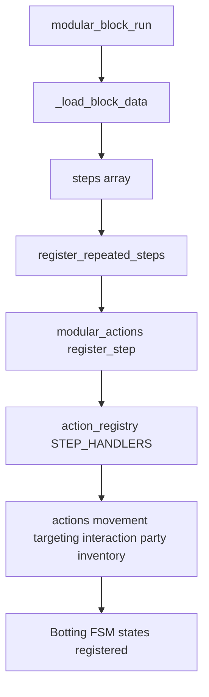
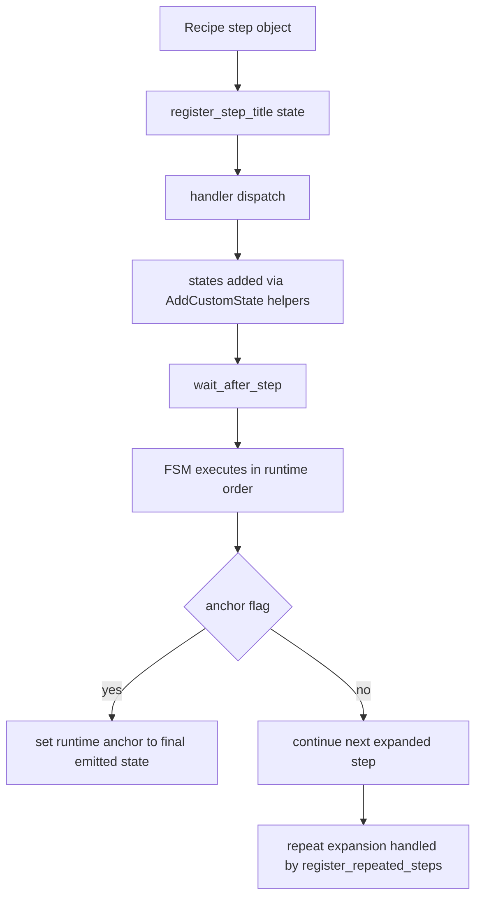
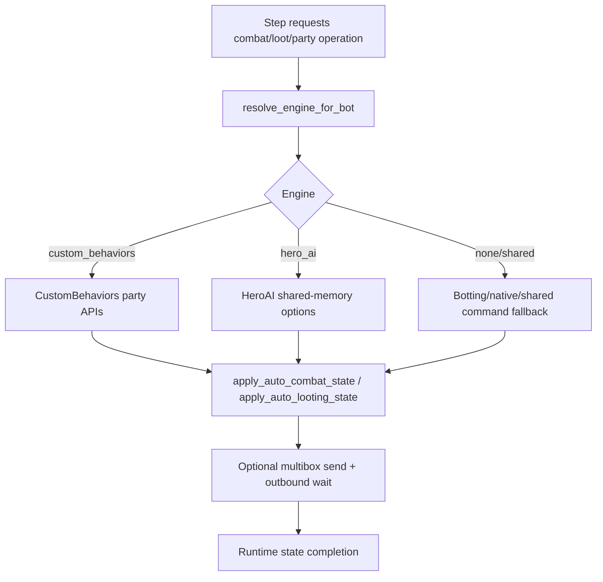

# Architecture

This page describes how ModularBot recipe JSON becomes FSM runtime behavior.

## Diagram 1: Block Load and Action Dispatch

## Diagram 2: Runtime FSM Lifecycle

## Diagram 3: Combat-Engine Hook Integration

## Recovery and Anchor

Recovery routing details are documented here:
- [Anchor and Recovery Fallback](anchor-and-recovery.md)
