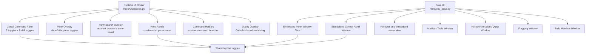

# HeroAI UI Inventory

## Goal

Map the current HeroAI UI surface so we can redesign it as one coherent system instead of several overlapping entry points.

Terminology used in this document:

- `Base UI`: the canonical HeroAI UI surface that exposes the full feature set
- `Floating windows`: an override UI layer that rehosts part of the base functionality in floating form

## High-Level Architecture

## Main Entry Points

### 1. Base UI

Primary implementation: `HeroAI/ui_base.py`

- Embedded tab strip above the native party window
- Embedded content area inside the native party window
- Standalone leader control panel window
- Follower-only embedded status tab
- Multibox tools window
- Standalone flagging window
- Follow formations quick window
- Build matches / supported builds browser

This is the canonical capability surface. It supports the broadest set of workflows and still owns several features that are not fully rehosted anywhere else.

### 2. Floating windows override layer

Primary router: `HeroAI/windows.py`

- Combined or separate hero panels
- Party overlay buttons attached to the native party window
- Party search overlay attached to native party tabs
- Floating global command panel
- Configurable command hotbars
- NPC dialog broadcast overlay
- Targeting floating buttons over enemies

This layer is best understood as a presentation override. It does not yet fully cover the base UI feature set, and some of its controls duplicate base UI functionality.

## Normalized Feature Inventory

These are the actual product features, grouped independently from which window currently hosts them.

### A. Core automation toggles

Per-account and global toggles:

- Following
- Avoidance
- Looting
- Targeting
- Combat
- Skill 1-8 enable toggles

Current hosts:

- Global command panel
- Base control panel
- Embedded party-window control panel
- Per-account control trees in leader views

### B. Per-account hero panel

Information and controls shown for each account:

- Character identity
  - Name or anonymous alias
  - Profession(s) and level
- Health bar
  - Regen
  - Poison / bleeding / degen-hexed states
  - Deep wound / enchantment / condition / hex / weapon spell indicators
- Energy bar
  - Current energy and regen
- Skill bar
  - 8 skills
  - Casting / availability visuals
- Buffs / upkeeps / effects
  - Duration display modes
  - Max effect rows
- Action buttons
  - Outpost: pixel stack, interact, dialog, load template, invite/summon, focus client
  - Explorable: pixel stack, interact, dialog, flag, clear flag, focus client

Presentation options:

- Combined panel vs separate windows
- Show only on leader
- Show/hide leader panel
- Show/hide bars
- Show/hide skills
- Show/hide buttons
- Show/hide upkeeps
- Show/hide effects

### C. Party-window overlays

Overlay features tied to the native Guild Wars party UI:

- Per-slot toggle button to show/hide each hero panel
- Party search overlay "Accounts" tab
- Account browser inside party search
  - Panel toggle for each account
  - Account list with profession/level/map
  - Select account
  - Double-click invite / kick / travel

These are strong candidates for keeping because they reuse familiar native UI anchors.

### D. Team command surface

Commands currently exposed across button bars and hotbars:

- Pixel Stack
- Interact With Target
- Dialog With Target
- Unlock Chest
- Open Consumables
- Flag Heroes
- Unflag Heroes
- Resign
- Donate Faction
- Pick Up Loot
- Prepare for Combat
- Disband Party
- Form Party
- Travel Alts to Leader Map
- Leave Party and Travel to Guild Hall
- Focus client

There are two current patterns:

- Fixed quick-command strips
- User-configurable command hotbars

### E. Consumables

Two separate UI variants exist for the same feature:

- Popup consumables chooser
- Standalone consumables window

Available actions are PCons / consumable broadcasts, exposed as icon grid buttons.

### F. Flagging and follow coordination

Features primarily hosted by the base UI:

- All-flag
- Individual hero/account flagging
- Clear flags
- Pin Down Flag Position
- Mouse capture for flag placement
- Optional standalone flagging window
- Optional follow formations quick window
  - Refresh formations
  - Choose saved formation
  - Follow threshold preset
  - Combat threshold preset
  - Flag threshold preset
  - Manual threshold values
  - Draw follower follow positions
  - Draw threshold rings
  - Toggle/show flagging window

Important note:

- The floating hero panel exposes account-level flag actions.
- The richer formation + threshold controls still live in the base UI.

### G. Party management / multibox tools

Features mainly found in base UI or overlay flows:

- Candidate browser
  - Invite nearby same-map accounts
  - Summon remote accounts by travel
- Party search account browser
  - Invite / kick / travel from native party UI overlay
- Open Party Window shortcut

### H. Dialog / cinematic helpers

- Ctrl+click NPC dialog option to send same selection to other accounts
- Ctrl+click skip cutscene for all accounts

These are "contextual overlays", not normal panels.

### I. Build / template tools

Base-UI-only or mostly base UI:

- Load skill template per account
- Build Matches window
  - Match current party builds
  - Supported builds browser
  - Skill info cards
  - Copy template

This feature family is valuable but currently detached from the newer UI flow.

### J. Settings / configuration

Current configure window tabs:

- General
  - Show Party Panel UI
  - Show Control Panel Window
  - Show Floating Target Buttons
  - Show Global Config Panel
  - Show Dialog Overlay
  - Confirm Follow Point
- Hero Panels
  - Panel visibility/layout/content toggles
- Hotbars
  - Add/remove hotbar
  - Rename
  - Show/hide
  - Dock target
  - Alignment
  - Button size
  - Rows / columns
  - Command assignment
- Blacklist
- Debug
  - Show Debug Window
  - Print Debug Messages

## Coverage Analysis

The important integration question is not "which UI is newer", but "which features from the base UI are already rehosted by floating windows, and which are still missing?"

### Fully or mostly represented in floating windows

- Per-account hero panels
- Party overlay panel toggles
- Party search account browser
- Global toggle panel
- Command hotbars
- Dialog broadcast overlay
- Consumables popup access

### Present in both, but implemented separately

- Core automation toggles
- Team command launchers
- Flagging entry points
- Consumables access
- Party/account control actions

### Still primarily base-UI-owned

- Embedded party-window tab workflow
- Standalone leader control panel workflow
- Follower-only embedded status view
- Follow formations quick window
- Follow threshold editing
- Build matches and supported builds browser
- Multibox tools window composition
- Some flagging workflows and runtime management

## Where The Duplication Is

### Same feature, multiple surfaces

- Core toggles exist in hero control windows, embedded tabs, and command panel
- Consumables exist as popup and standalone window
- Flagging exists in hero buttons, dedicated flagging window, and command actions
- Party/account management exists in candidate window and party search overlay
- Commands exist in fixed strips and hotbars

### Same product area, split ownership

- `ui_base.py` owns the canonical base UI workflows and several unique capabilities
- `windows.py` owns runtime composition for the floating-window override layer
- `ui.py` owns most floating-window-facing widgets, overlays, and panel rendering
- `globals.py` still exposes shared state and older window concepts used by both layers

## Suggested Feature Model For A Unified Redesign

If we normalize by user intent instead of by historical window boundaries, the UI wants roughly these sections:

1. Accounts
- Per-account status
- Per-account toggles
- Per-account actions

2. Team
- Global toggles
- Team commands
- Party management

3. Follow / Flag
- Flagging
- Formation selection
- Threshold tuning
- Follow diagnostics

4. Utilities
- Consumables
- Hotbars
- Build/templates
- Dialog/cutscene helpers

5. Settings
- Visibility/layout settings
- Overlay settings
- Debug/settings persistence

## Integration Strategy

Treat the base UI as the source of truth, then fold the floating-window override into it deliberately:

1. Define canonical feature ownership at the feature-family level
- Accounts
- Team commands
- Follow and flag
- Party management
- Utilities
- Settings and debug

2. For each family, classify every current control as one of:
- Canonical
- Override view
- Duplicate to remove
- Missing rehost target

3. Rebuild floating windows as a host/presentation layer, not as a second product surface
- It should reuse the same feature definitions and state
- It should not own separate business logic where avoidable

4. Migrate base-only capabilities into the shared model before removing duplicate UI
- Follow formations
- Threshold controls
- Build tools
- Advanced flagging flows

That approach preserves capability while making it possible to converge on one coherent UI system.

## Source Anchors

- `HeroAI/windows.py`: floating-window override composition and routing
- `HeroAI/ui.py`: floating hero panels, overlays, command panel, hotbars, configure window
- `HeroAI/ui_base.py`: base UI flows, flagging, formations, build browser
- `HeroAI/commands.py`: canonical command catalog for quick actions and hotbars
